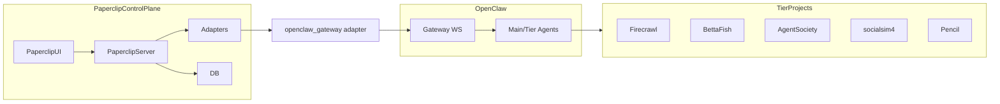

## Paperclip ↔ OpenClaw 架构总览

### 角色定位

- **Paperclip**：控制平面（Control Plane） + Issue/Goal/Project 工作流系统  
  - **Server**：`server/src/index.ts` + `server/src/app.ts`，提供 HTTP API、WebSocket 实时事件、UI 静态资源。
  - **UI**：`ui/`，Vite + React 单页应用，围绕 Issues / Goals / Projects / Agents 等页面组织。
  - **DB**：`packages/db/`（Drizzle ORM + Postgres），提供 schema、migrations、数据访问。
  - **Shared / Adapter-utils**：`packages/shared/`, `packages/adapter-utils/`，承载类型、通用执行契约。
  - **Adapters**：`packages/adapters/*` + `server/src/adapters/*`，对接本地 IDE / HTTP / OpenClaw 等执行环境。

- **OpenClaw**：多 Agent / 多项目协同执行引擎 + Gateway  
  - 核心配置：`/home/guo/projects/openclaw/openclaw.json`  
  - Gateway：基于 WebSocket 的网关服务，对接 Feishu 等外部渠道，并为 Paperclip 提供 Gateway 接入点。  
  - Agents：在 `openclaw.json` 中，把多个项目挂接为不同层级的 Agent：
    - `tier1-zephyr-nexus` → `/home/guo/workspace/ZephyrNexus`
    - `tier1-firecrawl` → `/home/guo/projects/firecrawl`
    - `tier2-bettafish` → `/home/guo/projects/BettaFish`
    - `tier2-pencil` → `/home/guo/pencil`
    - `tier3-agentsociety` → `/home/guo/projects/AgentSociety`
    - `tier3-socialsim4` → `/home/guo/projects/socialsim4`
    - 等等。

整体拓扑可以抽象为：



## Paperclip 内部关键路径

### 1. Heartbeat / Run 调度

- 模块：`server/src/services/heartbeat.ts`
- 责任：
  - 管理 `heartbeatRuns` 与 `agentWakeupRequests`，串起 Issue/Agent 的调度。
  - 计算 workspace/runtime，调用适配器执行（通过 `getServerAdapter`）。
  - 汇总 usage/cost/runtimeServices 写入 DB，推送 LiveEvents。

关键依赖：

- `getServerAdapter`：`server/src/adapters/index.ts` → `server/src/adapters/registry.ts`
- DB 表：`agents`, `heartbeatRuns`, `agentRuntimeState`, `agentTaskSessions`, `issues`, `projects`, `projectWorkspaces`, `heartbeatRunEvents`, `costEvents`
- Runtime/Workspace：
  - `server/src/services/workspace-runtime.ts`
  - `server/src/services/execution-workspace-policy.ts`

### 2. Adapters 注册与执行

- 统一注册：`server/src/adapters/registry.ts`
  - 通过 `ServerAdapterModule`（`packages/adapter-utils/src/types.ts`）描述：
    - `type`
    - `execute(ctx: AdapterExecutionContext)`
    - `testEnvironment`
    - `sessionCodec?`
    - `supportsLocalAgentJwt?`
    - `models` / `listModels`
    - `agentConfigurationDoc`
- 对外导出：`server/src/adapters/index.ts`
  - `getServerAdapter`, `listServerAdapters`, `listAdapterModels`, `findServerAdapter`

### 3. OpenClaw Gateway 适配器

- 包：`packages/adapters/openclaw-gateway/`
  - `src/server/execute.ts`：实现 Gateway 协议的执行逻辑。
  - `src/index.ts`：导出 `type`, `label`, `models`, `agentConfigurationDoc`。
  - `src/ui/*`：前端配置表单 & stdout 解析。

执行逻辑要点（`execute.ts`）：

- 构造 `WakePayload` + `paperclipEnv`（runId / agentId / companyId / issueId / wakeReason 等）。
- 生成面向 OpenClaw 的 `wakeText`，内含标准的 Paperclip API 调用流程与注意事项。
- 解析/构造：
  - Gateway URL（`ws://` / `wss://`）
  - 认证（token/password/deviceToken + 头部）
  - Device Auth（Ed25519 签名 payload，自动 pair 逻辑）。
- WebSocket 请求流程：
  - `connect.challenge` → `connect` → `agent` → `agent.wait`。
  - 订阅 `event agent`，把流式事件（assistant / error / lifecycle）写入日志。
- 抽取：
  - `usage`（tokens & cost）
  - `runtimeServices`（预览 URL / 后端服务）
  - `summary`（优先从事件流文本/最终 payload 提取）

### 4. Office Dispatch 支路（本地多项目协作）

- 在 `openclaw-gateway` 中，当 `officeDispatchEnabled` 为 true 时：
  - 构建包含 wakeText 和业务上下文的 Office 指令（角色如 `paperclip` / `code` / `research` / `firecrawl` / `pencil` 等）。
  - 通过 `office_dispatch.sh` 在本地调度 OpenClaw workspace 内的工具链（多项目协作）。

近期已做的优化：

- 将原来硬编码的：

```ts
"/home/guo/projects/openclaw-workspace/scripts/office_dispatch.sh"
```

替换为可配置/可探测路径：

- 配置字段：`officeDispatchScriptPath`（适配器配置中设置，最高优先级）。
- 环境变量：`OPENCLAW_OFFICE_DISPATCH_SCRIPT`。
- 默认路径：`$HOME/projects/openclaw-workspace/scripts/office_dispatch.sh`。

找不到脚本时返回明确错误：

- `openclaw_gateway_office_dispatch_script_missing`

这样 Paperclip + OpenClaw 的协同不再与单一机器路径绑定，更利于在新环境/容器/CI 中部署。

## 目标分层模型（逻辑层）

从当前结构出发，可以把 Paperclip 的逻辑分层抽象为：

- **Domain 层**（领域模型与业务规则）
  - 概念：`Agent`, `Issue`, `Goal`, `Project`, `Approval`, `ExecutionWorkspace`, `RuntimeService` 等。
  - 特征：
    - 不依赖框架和具体适配器。
    - 仅依赖 `packages/shared` / 未来的 `shared-domain` 中的纯 TS 类型与接口。

- **Application 层**（用例 / 服务）
  - 概念：`WakeAgent`, `ExecuteIssue`, `ApproveHire`, `ScheduleHeartbeat`, `ReapOrphanedRuns` 等用例。
  - 职责：
    - 编排 domain 操作，与 Port 接口交互（如 ExecutionEnginePort）。
    - 不直接知道 HTTP/CLI/UI 的细节，只使用纯对象入参/出参。

- **Infrastructure 层**（适配 / 存储 / 外部系统）
  - DB：
    - `packages/db`，实现 repository 接口，通过 Drizzle 访问 Postgres。
  - 执行引擎：
    - 各 `packages/adapters/*`，包括 `openclaw-gateway`、`cursor-local`、`codex-local`、`opencode-local` 等。
  - 观测与成本：
    - `costEvents`, `heartbeatRunEvents`, `langfuse` 等（未来可通过 TracingPort/ObservabilityPort 抽象）。

- **Interface / Delivery 层**
  - HTTP API：
    - `server/src/routes/*.ts`，以 REST 方式暴露 Issue/Goal/Agent/Approval 等入口。
  - Web UI：
    - `ui/pages/*` + `ui/components/*`，通过 React + TanStack Query 调用后端 API。
  - CLI：
    - `cli/`，提供面向开发/运维的命令行工具。

逻辑依赖方向应为：

```mermaid
flowchart TD
  delivery[Delivery (HTTP/UI/CLI)] --> application[Application (UseCases)]
  application --> domain[Domain]
  application --> ports[Ports (Execution/Tracing/DataIngestion)]
  ports --> infra[Infrastructure (DB/Adapters/ExternalSystems)]
```

目前的实现中：

- 这一分层已经在文件/包结构中有一定影子（如 `heartbeatService` 内部已经是一个 Application-ish 层），但是：
  - 路由层有时直接接触 DB/适配器。
  - 领域模型分散在 `db schema + shared types + server/services` 多处。

## 统一执行引擎 Port 抽象

为简化多适配器、多系统协作，我在 `packages/adapter-utils/src/types.ts` 中引入了一个轻量抽象（纯类型，不改旧行为）：

- **ExecutionEngineRequest**
  - 字段：
    - `ctx: AdapterExecutionContext`
  - 当前只是对 AdapterExecutionContext 的语义化封装，为后续加上：
    - 重试策略
    - 路由决策元数据
    - 统一 tracing 信息
    等提供挂载点。

- **ExecutionEngineResult**
  - 类型别名：`AdapterExecutionResult`
  - 让 “执行结果” 在逻辑上有一个独立名字，方便 Application 层描述依赖。

- **ExecutionEnginePort**
  - 字段：
    - `type: string` —— 逻辑引擎类型（例如 `"openclaw"`, `"process"`, `"http"`, `"firecrawl"`）。
    - `execute(request: ExecutionEngineRequest): Promise<ExecutionEngineResult>`。
  - 在简单情况中，一个 `ExecutionEnginePort` 可以直接包一层现有 `ServerAdapterModule`；
  - 在复杂情况中，它可以封装：
    - 多适配器 fan-out；
    - 基于上下文（issue 类型、项目、成本上限等）的路由；
    - 统一重试/熔断/超时策略。

短期内，这个抽象没有强制改变现有代码，只作为：

- Application 层（如 future 的 `executionService`）对执行引擎的抽象依赖。
- adapter-utils 作为“契约中心”，统一 paperclip 对外部引擎的期待。

## 渐进式演进建议（概要）

1. **短期（已开始）**
   - 解耦所有硬编码的本地路径与环境依赖（如 openclaw office-dispatch）。
   - 在 `adapter-utils` 中稳定 ExecutionEnginePort 抽象，为 Application 层引入统一依赖点。

2. **中期**
   - 提取一个轻量的 `executionService`（Application 层），负责：
     - 从 Agent/Issue/Workspace 视角构造 ExecutionEngineRequest；
     - 调用 ExecutionEnginePort（目前可以由 `getServerAdapter` 简单包装实现）。
   - 逐步让 heartbeat/issue-flow 等用例改为依赖 executionService，而不是直接拿 adapter 执行。

3. **长期**
   - 为外部系统统一 Port 抽象：
     - `ExecutionEnginePort`：OpenClaw、本地进程、HTTP LLM、Firecrawl 等。
     - `TracingPort`：Langfuse/其他观测系统。
     - `DataIngestionPort`：Firecrawl/爬虫类系统。
   - 将跨项目共用的“协议层模型”（runId、workspace、runtimeServices、usage/cost 等）沉淀到一个稳定的 shared-domain 中，Paperclip、OpenClaw 及其他项目都对齐到同一套 schema。

